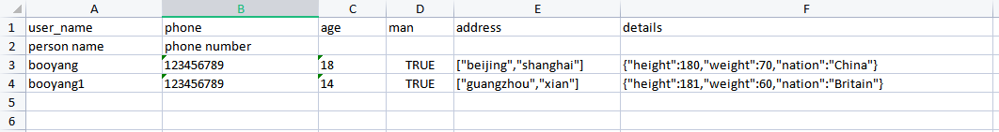

## 介绍

excelstructure是一个excel结构体互转的工具，可以将结构体转换为excel，也可以将excel转换为结构体，同时也支持单行字段值获取

## 基础使用

### 安装

`go get github.com/booyangcc/excelstructure`

### 简单使用

```golang
infos := []*Info{
    {
        Name:    "booyang",
        Phone:   convutil.String("123456789"),
}

p := NewParser()
// 因为结构体字段有comment标签，所以写入的时候，数据从第三行开始，所以读取的时候，数据偏移量为2
p.DataIndexOffset = 2
// 写入
err = p.Write("./test_excel_file/test_write.xlsx", "Infos", infos)
if err != nil {
    fmt.Println(err)
}

var newInfo []*Info
// 读取
err = p.Read("./test_excel_file/test_write.xlsx", &newInfo)
if err != nil {
    fmt.Println(err)
}

```

### 完整样例

```golang
package main

import (
	"fmt"
	"github.com/booyangcc/utils/convutil"
    "github.com/booyangcc/excelstructure"
)


type Detail struct {
	Height int    `json:"height"`
	Weight int    `json:"weight"`
	Nation string `json:"nation"`
}

type Info struct {
	Name    string   `excel:"column:user_name;comment:person name"`
	Phone   *string  `excel:"column:phone;comment:phone number"`
	Age     string   `excel:"column:age;"`
	Man     bool     `excel:"column:man;default:true"`
	Address []string `excel:"column:address;serializer:mySerializer"`
	Detail  Detail   `excel:"column:details;serializer:mySerializer"` // 你可以使用自定义序列化，默认使用json，此处使用我们的自定义序列化mySerializer
}

var (
	// 自定的序列化
	mySerializer = Serializer{
		Marshal: func(v interface{}) (string, error) {
			bs, err := json.Marshal(v)
			if err != nil {
				return "", err
			}
			return string(bs), nil
		},
		Unmarshal: func(s string, v interface{}) error {
			return json.Unmarshal([]byte(s), v)
		},
	}
)

// TestWriteRead 使用方式1，解析写入到结构体
func TestWriteRead() {
	infos := []*Info{
		{
			Name:    "booyang",
			Phone:   convutil.String("123456789"),
			Age:     "18",
			Man:     true,
			Address: []string{"beijing", "shanghai"},
			Detail: Detail{
				Height: 180,
				Weight: 70,
				Nation: "China",
			},
		},
		{
			Name:    "booyang1",
			Phone:   convutil.String("123456789"),
			Age:     "14",
			Man:     false,
			Address: []string{"guangzhou", "xian"},
			Detail: Detail{
				Height: 181,
				Weight: 60,
				Nation: "Britain",
			},
		},
	}
	p := NewParser()
	// 注册自定义序列化
	err := p.RegisterSerializer("mySerializer", mySerializer)
	if err != nil {
		return
	}
	// 写入单个
	err = p.Write("./test_excel_file/test_write.xlsx", "Infos", infos)
	if err != nil {
		fmt.Println(err)
	}

	/*
		// 写入两个sheet， 分别为Info1和Info2，数据相同
		err = p.WriteWithMultiSheet("./test_excel_file/test_write_multi.xlsx", map[string]interface{}{
			"Info1": infos,
			"Info2": infos,
		})
		if err != nil {
			fmt.Println(err)
		}
	*/
	// 因为结构体字段有comment标签，所以写入的时候，数据从第三行开始，所以读取的时候，数据偏移量为2
	p.DataIndexOffset = 2
	var newInfo []*Info

	err = p.Read("./test_excel_file/test_write.xlsx", &newInfo)
	if err != nil {
		fmt.Println(err)
	}
	/*
		// 多sheet读取，读取sheet Info1和Info2到newInfo1和newInfo2
		var newInfo1 []*Info
		var newInfo2 []*Info
		err = p.ReadWithMultiSheet("./test_excel_file/test_write_multi.xlsx", map[string]interface{}{
			"Info1": &newInfo1,
			"Info2": &newInfo2,
		})
	*/
	if err != nil {
		fmt.Println(err)
	}

	fmt.Printf("oldInfo: %+v, newInfo: %+v", infos, newInfo)
}

// TestParse 使用方式二，直接获取行的某一列数据
func TestParse() {
	p := NewParser()
	// 使用自定义序列化
	err := p.RegisterSerializer("mySerializer", mySerializer)
	if err != nil {
		return
	}
	// 因为结构体字段有comment标签，所以写入的时候，数据从第三行开始，所以读取的时候，数据偏移量为2
	p.DataIndexOffset = 2
	excelData, err := p.Parse("./test_excel_file/test_write.xlsx")
	if err != nil {
		fmt.Println(err)
	}

	s := excelData.SheetNameData["Infos"]
	row3UserName, err := s.GetStringValue(3, "user_name")
	if err != nil {
		fmt.Println(err)
	}

	row3age, err := s.GetIntValue(3, "age")
	if err != nil {
		fmt.Println(err)
	}
	fmt.Println(row3UserName, row3age)

	row4UserName, err := s.GetStringValue(4, "user_name")
	if err != nil {
		fmt.Println(err)
	}

	row4age, err := s.GetIntValue(4, "age")
	if err != nil {
		fmt.Println(err)
	}
	fmt.Println(row4UserName, row4age)
}

```
***excel data*** 输出的excel



## 使用

### tag配置
tag字段设置,tag名称`excel`
> Name string `excel:"column:user_name;comment:person name;skip;default:boo;serializer:mySerializer"`
- column：解析或写入excel的head头
- comment：任意一结构体的字段exceltag 包含了这个配置，则输出excel的时候第二行为comment
- skip：标注当前字段跳过，不解析也不写入excel
- default：解析或设置如果字段为零值则使用default替换
- serializer: 结构体，切片，Interface等类型的序列化与反序列化，支持自定义


### parser使用
parser参数
- FileName 读的文件
- DataIndexOffset 数据索引偏移量,第一行可能为表头，则偏移量为1，如果有注释占用一行，则为2。默认为1
- BoolTrueValues bool值为true的可选项，默认为[true,True,TRUE,1,是,yes,Yes,YES,y,Y]。使用时可以手动指定
- IsCheckEmpty 序列化到结构提的时候是否检测空值如果为空值则报错
- IsEmptyFunc 检测是否为空的回调函数，默认为 `func(v string) bool  {return v==""}`
- IsCoordinatesABS cell坐标值类型 ，ture返回坐标A1, false为$A$1
- ExcelData 解析出来的数据值
- AllowFieldRepeat 是否允许重复字段允许则覆盖

